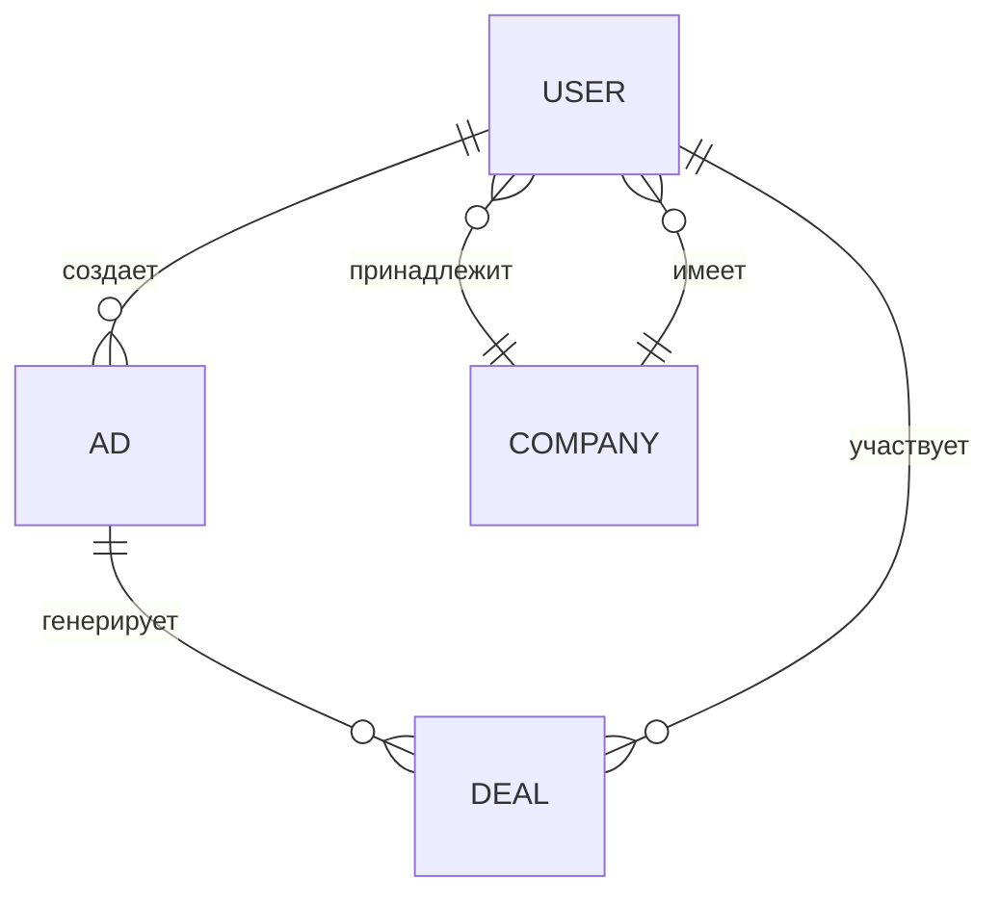

## 🏗️ Архитектура проекта

### Общая схема

- **Frontend**: Vue 3 (TypeScript) + Inertia.js (SPA взаимодействие с Laravel)
- **Backend**: Laravel 12 (REST/SPA, сервисный слой, валидация, политика доступа)
- **Медиа**: Spatie Media Library для хранения изображений и документов
- **UI**: TailwindCSS, ShadCN компоненты
- **База данных**: MySQL/PostgreSQL

### Основные сущности и связи

- **User**: username, email, password, role (director/manager), company_id
- **Company**: inn, name, verified, ...
- **Ad**: title, description, price, status, user_id, media (Spatie)
- **Deal**: status, ad_id, user_id, документы (Spatie)

### Сервисный слой

- **AdService**: создание/редактирование объявлений, работа с медиа
- **MediaService**: загрузка, удаление, fallback, mime-types (рекомендуется централизовать)
- **UserService** (потенциально): логика управления пользователями и ролями

### Роли и права

- **director**: первый пользователь в компании, имеет расширенные права
- **manager**: остальные пользователи компании
- Для всех действий используются Laravel Policy (рекомендуется расширить покрытие)

---

_Для более подробной схемы можно использовать draw.io, PlantUML или ссылку на онлайн-диаграмму._
