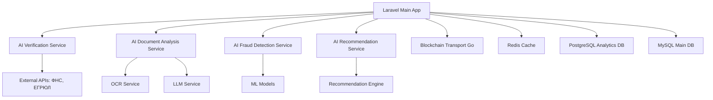

# 🤖 План развития проекта Whiteboard с интеграцией ИИ-агентов

## Текущее состояние проекта

### Сильные стороны
- ✅ Современный техстек (Laravel 12, Vue 3, TypeScript)
- ✅ Сервисная архитектура с микросервисом на Go
- ✅ Блокчейн интеграция для сделок
- ✅ Система ролей и компаний
- ✅ Медиа-библиотека для документов
- ✅ Chat система между пользователями

### Проблемы для решения
- ❌ Нет автоматической проверки контрагентов
- ❌ Отсутствует анализ юридических документов
- ❌ Нет системы выявления мошенников
- ❌ Отсутствуют умные рекомендации
- ❌ Нет анализа рыночных цен

---

## 🎯 Стратегия внедрения ИИ

### Фаза 1: Система верификации контрагентов (2-3 недели)

#### 1.1 ИИ-агент для проверки ИНН и компаний
```php
// Новый сервис
app/Services/AI/ContractorVerificationService.php
```

**Функционал:**
- Автоматическая проверка ИНН через API ФНС, ЕГРЮЛ
- Анализ финансового состояния через открытые источники
- Проверка в реестрах недобросовестных поставщиков
- Анализ судебных дел и исков
- Scoring надежности контрагента (0-100 баллов)

**Технологии:**
- LLM для анализа текстовых данных о компании
- Web scraping для сбора информации
- API интеграции: nalog.ru, fedresurs.ru, kad.arbitr.ru

#### 1.2 Расширение модели Company
```php
// Добавить поля в миграцию
'verification_score' => 'integer default 0',
'verification_status' => 'string default pending',
'verification_data' => 'json nullable',
'risk_level' => 'enum low,medium,high default medium',
'last_verified_at' => 'timestamp nullable',
```

### Фаза 2: Анализ юридических документов (3-4 недели)

#### 2.1 ИИ-агент для анализа документов
```php
// Новый сервис
app/Services/AI/DocumentAnalysisService.php
```

**Возможности:**
- OCR для сканированных документов
- Извлечение ключевых данных из договоров
- Проверка корректности реквизитов
- Анализ рисков в условиях договора
- Автоматическое заполнение полей Deal на основе документов

**Технологии:**
- Tesseract OCR для распознавания текста
- LLM (GPT-4/Claude) для анализа содержания
- Computer Vision для определения типа документа

#### 2.2 Умная загрузка документов
```vue
<!-- Компонент с ИИ-анализом -->
resources/js/components/SmartDocumentUploader.vue
```

### Фаза 3: Fraud Detection система (4-5 недель)

#### 3.1 ИИ-агент детекции мошенничества
```php
app/Services/AI/FraudDetectionService.php
```

**Алгоритмы:**
- Анализ поведенческих паттернов пользователей
- Детекция подозрительных цен (значительно выше/ниже рынка)
- Анализ частоты создания объявлений
- Проверка дубликатов объявлений с разными ценами
- Анализ географических аномалий

#### 3.2 Real-time мониторинг
- Event-driven архитектура для отслеживания подозрительных действий
- Automatic suspension подозрительных аккаунтов
- Уведомления администраторам о потенциальном мошенничестве

### Фаза 4: Система рекомендаций (3-4 недели)

#### 4.1 ИИ-рекомендательная система
```php
app/Services/AI/RecommendationService.php
```

**Функции:**
- Рекомендации объявлений на основе истории просмотров
- Подбор контрагентов по профилю компании
- Предложение оптимальных цен на основе рыночного анализа
- Персонализированные предложения по категориям

#### 4.2 ML модель для pricing
- Анализ исторических данных сделок
- Предикт оптимальной цены для объявления
- Региональные ценовые коэффициенты

### Фаза 5: Чат-бот помощник (2-3 недели)

#### 5.1 ИИ-агент поддержки
```php
app/Services/AI/ChatBotService.php
```

**Возможности:**
- Помощь в создании объявлений
- Ответы на вопросы о платформе
- Консультации по оформлению сделок
- Автоматическая категоризация объявлений

---

## 🏗️ Техническая архитектура

### Микросервисная архитектура с ИИ


### Новые микросервисы (Python/FastAPI)

#### 1. AI Verification Service
```python
# /ai-services/verification/
- Проверка ИНН и юридических лиц
- Scoring контрагентов
- Интеграция с внешними API
```

#### 2. AI Document Analysis Service
```python
# /ai-services/document-analysis/
- OCR обработка
- Извлечение данных из документов
- Анализ рисков в договорах
```

#### 3. AI Fraud Detection Service
```python
# /ai-services/fraud-detection/
- Real-time анализ поведения
- ML модели для детекции аномалий
- Скоринг подозрительности
```

#### 4. AI Recommendation Service
```python
# /ai-services/recommendations/
- Collaborative filtering
- Content-based рекомендации
- Price prediction модели
```

---

## 🔧 План реализации по спринтам

### Спринт 1-2 (Система верификации)
1. Создать микросервис верификации на FastAPI
2. Интегрировать с API ФНС и ЕГРЮЛ
3. Добавить поля в модель Company
4. Создать UI для отображения статуса верификации
5. Настроить автоматическую проверку при регистрации

### Спринт 3-4 (Анализ документов)
1. Развернуть OCR сервис (Tesseract)
2. Интегрировать с LLM для анализа контрактов
3. Создать умный загрузчик документов
4. Добавить автозаполнение полей на основе документов
5. Внедрить проверку корректности реквизитов

### Спринт 5-6 (Fraud Detection)
1. Собрать и разметить данные для обучения ML моделей
2. Обучить модели детекции мошенничества
3. Внедрить real-time мониторинг
4. Создать админ панель для управления подозрительными аккаунтами
5. Настроить автоматические уведомления

### Спринт 7-8 (Рекомендации и ML)
1. Создать recommendation engine
2. Обучить модели на исторических данных
3. Внедрить персонализированные рекомендации в UI
4. Добавить price prediction для объявлений
5. A/B тестирование рекомендательной системы

### Спринт 9-10 (Чат-бот и оптимизация)
1. Интегрировать LLM чат-бота в существующую чат систему
2. Настроить knowledge base для специфики строительной отрасли
3. Добавить автоматическую категоризацию объявлений
4. Оптимизировать производительность всех ИИ-сервисов
5. Мониторинг и аналитика использования ИИ-функций

---

## 📊 Конкурентные преимущества

### 1. **Доверие и безопасность**
- Автоматическая проверка контрагентов повышает доверие
- Система fraud detection снижает риски мошенничества
- Анализ документов минимизирует ошибки в сделках

### 2. **Удобство использования**
- ИИ-помощник упрощает создание объявлений
- Автозаполнение данных из документов экономит время
- Персонализированные рекомендации улучшают user experience

### 3. **Рыночная аналитика**
- Price prediction помогает устанавливать конкурентные цены
- Аналитика трендов в строительной отрасли
- Прогнозирование спроса по регионам

### 4. **Масштабируемость**
- Готовность к расширению на другие отрасли
- Микросервисная архитектура позволяет независимое развитие
- ML модели можно переобучать для новых секторов

---

## 💰 Монетизация ИИ-функций

### Freemium модель
- **Базовый**: Базовая верификация ИНН
- **Pro**: Полный анализ контрагентов + fraud detection
- **Enterprise**: Все ИИ-функции + API доступ + аналитика

### Дополнительные сервисы
- Консультации по оформлению сделок
- Аналитические отчеты по рынку
- White-label решение для других отраслей

---

## 🔍 Метрики успеха

### Бизнес-метрики
- Увеличение конверсии регистраций на 30%
- Снижение количества мошеннических сделок на 80%
- Рост активности пользователей на 50%
- Увеличение среднего чека сделок на 20%

### Технические метрики
- Время верификации контрагента < 30 секунд
- Точность fraud detection > 95%
- Relevance рекомендаций > 85%
- Uptime ИИ-сервисов > 99.9%

---

## 🚀 Дальнейшее развитие

### Интеграция с внешними системами
- 1C интеграция для автоматического импорта данных
- Интеграция с банковскими API для проверки платежеспособности
- Связь с логистическими системами для доставки

### Расширение на другие отрасли
- Промышленное оборудование
- IT услуги
- Недвижимость
- Логистика

### Advanced AI функции
- Computer Vision для анализа фотографий объектов
- Natural Language Processing для автоматической генерации описаний
- Predictive Analytics для прогнозирования трендов рынка
